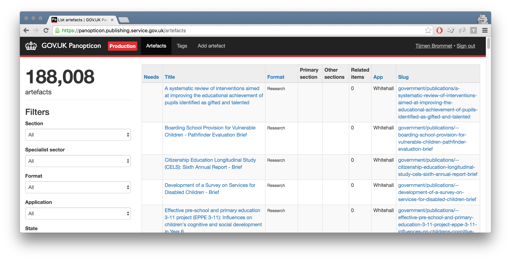

# Panopticon

Panopticon is an application originally built to act as a central repository for content on GOV.UK. It is being deprecated.



## Live examples

- [panopticon.publishing.service.gov.uk](https://panopticon.publishing.service.gov.uk)

## Features & deprecation

| Feature | Replacement | Status |
|---|---|---|
| Specifying legacy source | Feature removed | Done |
| Tagging documents | Any document on GOV.UK will be taggable in [content-tagger](https://github.com/alphagov/content-tagger) | Partially done |
| Registering routes |  The [content-store](https://github.com/alphagov/content-store) registers routes for any content-item that doesn't have the "placeholder" format | Partially done |
| Creating tags (via API) | Creating tags is done in [collections-publisher](https://github.com/alphagov/collections-publisher). Once nothing is using tags from the content-api this feature can be removed | Partially done |
| Creating artefacts for [mainstream publisher](https://github.com/alphagov/publisher) | To be decided | Not started |
| Specifying related items | To be decided | Not started |
| Sending data to Rummager | The [publishing-api](https://github.com/alphagov/publishing-api) will send the content item to the message queue, which will be picked up by [rummager](https://github.com/alphagov/rummager) | Not started |
| Syncing links from publishing-api ([see](#running-the-message-queue)) | Frontend apps will start using the content-store for the taggings | Not started |
| See a history of document changes | To be decided | Not started |

## Nomenclature

- **Artefact**: a document on GOV.UK.

## Technical documentation

Panopticon provides three interfaces:

- An admin UI where items can be created and their metadata edited
- A writeable API where applications can register the content they provide
- A read API for retrieving metadata about a given item

Panopticon shares a database with [Mainstream Publisher](https://github.com/alphagov/publisher), [Content API](https://github.com/alphagov/govuk_content_api) and [Travel Advice Publisher](https://github.com/alphagov/travel-advice-publisher). They share application code via the [govuk_content_models](https://github.com/alphagov/govuk_content_models) gem.

### Dependencies

- [publishing-api](https://github.com/alphagov/publishing-api) for registering URLs.
- [router-api](https://github.com/alphagov/router-api) also for registering URLs.
- [rummager](https://github.com/alphagov/rummager) for sending data to search.

### Running the application

In the development VM:

```
cd /var/govuk/development && bowl panopticon
```

The app with appear at http://panopticon.dev.gov.uk/.

### Running the message queue

Frontend apps rely on the tagging data in  [content_api](https://github.com/alphagov/govuk_content_api) to show breadcrumbs. Panopticon listens to any changes in publishing-api via the message queue and saves this data.

To run the message queue:

```
govuk_setenv panopticon bundle exec rake message_queue:consumer
```

### Running the test suite

`bundle exec rake`

## Licence

[MIT License](LICENCE)
